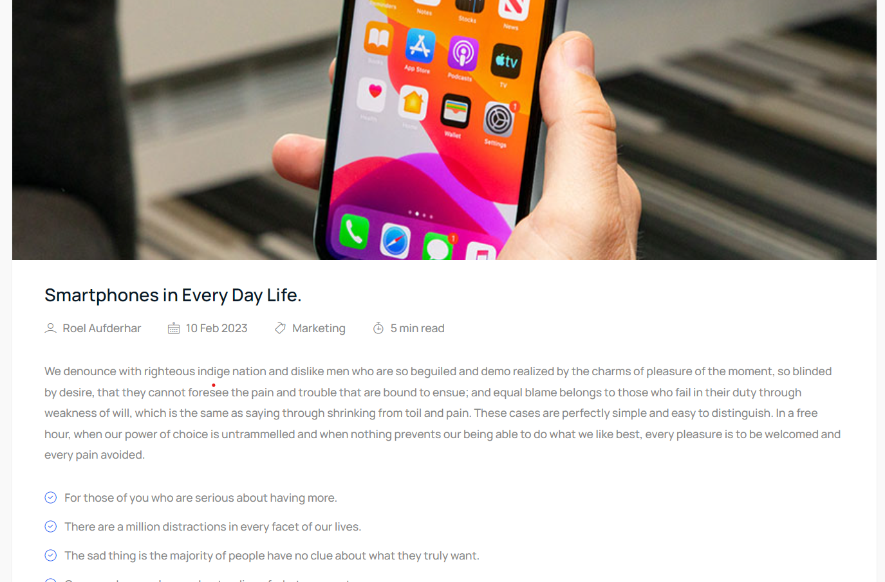

# eCommerce Store UI Design

This repository contains the UI design for an eCommerce store. The design includes multiple pages commonly found in online stores. It's built using **HTML**, **CSS**, and **Bootstrap** to ensure a responsive and modern user interface.

## Pages Included

- **Home Page**: The landing page of the eCommerce store.
- **Category Page**: Displays different product categories.
- **About Page**: Information about the business.
- **FAQ Page**: Frequently asked questions for customer support.
- **Login Page**: User login form.
- **Register Page**: User registration form.
- **Shop Page**: Displays all products available for purchase.
- **Single Product Page**: Detailed information about a specific product.
- **Blog Page**: A list of blog posts.
- **Blog Single Page**: Details of an individual blog post.
- **Contact Us Page**: Contact form for customers to reach out.

## Technologies Used

- **HTML5**
- **CSS3**
- **Bootstrap 5**

## How to Run the Project

1. Clone the repository:

   ```bash
   git clone https://github.com/your-username/ecommerce-store-ui.git

   ```

2. Navigate to the project directory:

   ```bash
   cd ecommerce-store-ui
   ```

3. Open the `index.html` file in your browser.

## Features

- Responsive layout for all devices
- Clean and modern design
- Easy to navigate and customize

## Screenshots

- Home Page
  

- About Page
  

- Login Page
  

- Register Page
  

- Shop Page
  

- Single Product
  

- blog
  

- Single Post
  

- Contact
  

-FAQ


## Acknowledgements

- [Bootstrap 5](https://getbootstrap.com/)

## Contributing

If you'd like to contribute to ecommerce UI, feel free to submit a pull request. We welcome contributions!

## Credits

This ecommerce UI was created by uttam and is distributed under the MIT License. Feel free to use, modify, and distribute it as you see fit.

We hope you find this app useful for sharing files! If you have any questions or need further assistance.

Happy coding! 🚀
